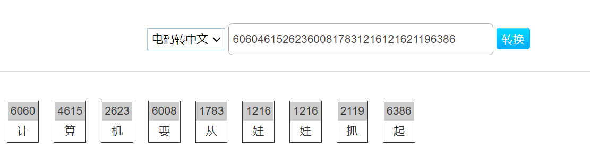
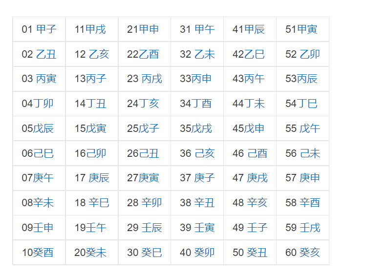
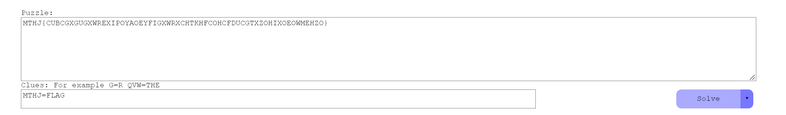
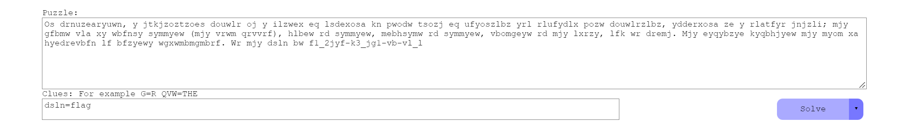

前面的题都非常简单，都是一血常见编码

# 0x01.MD5

下载解压打开：`e00cf25ad42683b3df678c61f42c6bda`

直接md5在线解密，之后flag包含`flag{admin}`提交即可。

# 0x02.一眼就解密

base64，直接在线解密即可

# 0x03.Url编码

下载附件打开，题目提示很明显了，丢在线直接解

# 0x04.看我回旋踢

题目提示为循环相关，猜测rot系列，根据flag头可知为ROT13，在线解密即可

# 0x05.摩丝

不能再明显了，，莫斯在线解密。

# 0x06.password

没太大意思，就是社工出密码(爆破),,

flag{zs19900315}

# 0x07.变异凯撒

根据提示，跟凯撒解密有关，但是应该有变形。


结合flag头与所给字符串可知：f-5=a，l-f=6，Z-a=7.....

```python
str = 'afZ_r9VYfScOeO_UL^RWUc'
flag = ''
i = 5
for c in a:
    b += chr(ord(c)+i)
    i = i+1
print(flag)
```

# 0x08.Quoted-printable

`Quoted-printable`也是一种编码方式，常用在电子邮件中，具体原理可以google，直接丢到在线解密网站解密就可。之后使用flag来包含提交。

# 0x09.Rabbit

>   Rabbit 是一种高速流密码，于 2003 年在 FSE 研讨会上首次提出。Rabbit 使用一个 128 位密钥和一个 64 位初始化向量。该加密算法的核心组件是一个位流生成器，该流生成器每次迭代都会加密 128 个消息位。Rabbit 也是一种对称加密算法。

所以还是直接丢在线网站

# 0x0A.篱笆墙的影子

篱笆墙，提示的很明显了，就是栅栏密码。

# 0x0B.RSA

>   在一次RSA密钥对生成中，假设p=473398607161，q=4511491，e=17
>   求解出d作为flga提交

开始有正常的题了。

需要gmpy2的库，已知pq和e，求d：

e,d,phi满足：

-   1 < d < phi

-   E＊D mod phi ＝ 1

这里简单说下gmpy2：

-   mpz用于初始化大整数
-   invert用于求逆元
    -   E＊D mod phi ＝ 1
    -   那么`D = gmpy2.invert(E, phi)`

```python
import gmpy2

p = gmpy2.mpz(473398607161)
q = gmpy2.mpz(4511491)
e = gmpy2.mpz(17)
phi = (p - 1) * (q - 1)
d = gmpy2.invert(e, phi)
print (d)
```

# 0x0C.丢失的MD5


```python
import hashlib   
for i in range(32,127):
    for j in range(32,127):
        for k in range(32,127):
            m=hashlib.md5()
            m.update('TASC'+chr(i)+'O3RJMV'+chr(j)+'WDJKX'+chr(k)+'ZM')
            des=m.hexdigest()
            if 'e9032' in des and 'da' in des and '911513' in des:
                print des
```

泡一下得flag


# 0x0D.Alice与Bob

98554799767

大数分解，直接丢在线解密：`101999*966233`

之后md5加密，32位，小写

# 0x0E.rsarsa

题目：

```
Math is cool! Use the RSA algorithm to decode the secret message, c, p, q, and e are parameters for the RSA algorithm.


p =  9648423029010515676590551740010426534945737639235739800643989352039852507298491399561035009163427050370107570733633350911691280297777160200625281665378483
q =  11874843837980297032092405848653656852760910154543380907650040190704283358909208578251063047732443992230647903887510065547947313543299303261986053486569407
e =  65537
c =  83208298995174604174773590298203639360540024871256126892889661345742403314929861939100492666605647316646576486526217457006376842280869728581726746401583705899941768214138742259689334840735633553053887641847651173776251820293087212885670180367406807406765923638973161375817392737747832762751690104423869019034

Use RSA to find the secret message
```

直接gmpy2写：

```python
import gmpy2


# p =  9648423029010515676590551740010426534945737639235739800643989352039852507298491399561035009163427050370107570733633350911691280297777160200625281665378483
# q =  11874843837980297032092405848653656852760910154543380907650040190704283358909208578251063047732443992230647903887510065547947313543299303261986053486569407
# e =  65537
# c =  83208298995174604174773590298203639360540024871256126892889661345742403314929861939100492666605647316646576486526217457006376842280869728581726746401583705899941768214138742259689334840735633553053887641847651173776251820293087212885670180367406807406765923638973161375817392737747832762751690104423869019034

p = gmpy2.mpz(9648423029010515676590551740010426534945737639235739800643989352039852507298491399561035009163427050370107570733633350911691280297777160200625281665378483)
q = gmpy2.mpz(11874843837980297032092405848653656852760910154543380907650040190704283358909208578251063047732443992230647903887510065547947313543299303261986053486569407)
e = gmpy2.mpz(65537)
c = gmpy2.mpz(83208298995174604174773590298203639360540024871256126892889661345742403314929861939100492666605647316646576486526217457006376842280869728581726746401583705899941768214138742259689334840735633553053887641847651173776251820293087212885670180367406807406765923638973161375817392737747832762751690104423869019034)
n = p*q
phi = (p-1)*(q-1)
d = gmpy2.invert(e,phi)
m = pow(c,d,n)
print (m)
```

# 0x0F.大帝的密码武器

winhex打开，标志位为PK，改后缀为zip打开

题目：

```
公元前一百年，在罗马出生了一位对世界影响巨大的人物，他生前是罗马三巨头之一。他率先使用了一种简单的加密函，因此这种加密方法以他的名字命名。
以下密文被解开后可以获得一个有意义的单词：FRPHEVGL
你可以用这个相同的加密向量加密附件中的密文，作为答案进行提交。
```

密文：

```
ComeChina
```

应该还是凯撒，毕竟公园前一百年，之后使用凯撒密码列举解密该单词

得到一个有意义的单词：`SECURITY`，位移为13之后加密，还是13位：`PbzrPuvan`

# 0x10.Windows系统密码

```
Administrator:500:aad3b435b51404eeaad3b435b51404ee:31d6cfe0d16ae931b73c59d7e0c089c0:::
ctf:1002:06af9108f2e1fecf144e2e8adef09efd:a7fcb22a88038f35a8f39d503e7f0062:::
Guest:501:aad3b435b51404eeaad3b435b51404ee:31d6cfe0d16ae931b73c59d7e0c089c0:::
SUPPORT_388945a0:1001:aad3b435b51404eeaad3b435b51404ee:bef14eee40dffbc345eeb3f58e290d56:::
```

ctf第二个的md5解密：`flag{good-luck}`

# 0x11.信息化时代的步伐

中文电码：https://dianma.bmcx.com/



# 0x12.传统知识+古典密码

这题没啥意思，后面就是猜了，，，

题目：

```
小明某一天收到一封密信，信中写了几个不同的年份
          辛卯，癸巳，丙戌，辛未，庚辰，癸酉，己卯，癸巳。
          信的背面还写有“+甲子”，请解出这段密文。

key值：CTF{XXX}
```

另外的一个文件夹是buu题放错位置了应该，和那个没关系。

先是传统知识：



一甲子为60，所以  辛卯，癸巳，丙戌，辛未，庚辰，癸酉，己卯，癸巳，分别+60，正好是ASCII码：`XZSDMFLZ`

栅栏：`XMZFSLDZ`

之后凯撒尝试：`SHUANGYU`

# 0x13.凯撒？替换？呵呵!

```
MTHJ{CUBCGXGUGXWREXIPOYAOEYFIGXWRXCHTKHFCOHCFDUCGTXZOHIXOEOWMEHZO} 
```

凯撒尝试后不对，那就应该和替换也有关

也就是说MTHJ并不对应flag，只能尝试暴力破解，在线：

https://quipqiup.com/



第一个就是

```
flag substitution cipher decryption is always easy just like a piece of cake
```

`flag{substitutioncipherdecryptionisalwayseasyjustlikeapieceofcake}`

# 0x14.萌萌哒的八戒

很明显了，猪圈密码。

`flag{whenthepigwanttoeat}`

# 0x15.RSA1

>   [RSA:由p,q,dp,dq,c求明文的算法](https://blog.csdn.net/qi_SJQ_/article/details/121986063)

dp,dq的存在使得**解密**更快

>   首先了解一下什么是dp、dq
>
>   ```
>   dp=d mod (p-1)
>   dq=d mod (q-1)
>   ```
>
>   这种参数是为了让**解密**的时候更快速产生的

```
p = 8637633767257008567099653486541091171320491509433615447539162437911244175885667806398411790524083553445158113502227745206205327690939504032994699902053229 
q = 12640674973996472769176047937170883420927050821480010581593137135372473880595613737337630629752577346147039284030082593490776630572584959954205336880228469 
dp = 6500795702216834621109042351193261530650043841056252930930949663358625016881832840728066026150264693076109354874099841380454881716097778307268116910582929 
dq = 783472263673553449019532580386470672380574033551303889137911760438881683674556098098256795673512201963002175438762767516968043599582527539160811120550041 
c = 24722305403887382073567316467649080662631552905960229399079107995602154418176056335800638887527614164073530437657085079676157350205351945222989351316076486573599576041978339872265925062764318536089007310270278526159678937431903862892400747915525118983959970607934142974736675784325993445942031372107342103852
```

解题模板：

```python
I=gmpy2.invert(q,p)
mp=pow(c,dp,p)
mq=pow(c,dq,q)
m=(((mp-mq)*I)%p)*q+mq
```

exp：

```python
import gmpy2
import binascii

p = 8637633767257008567099653486541091171320491509433615447539162437911244175885667806398411790524083553445158113502227745206205327690939504032994699902053229 
q = 12640674973996472769176047937170883420927050821480010581593137135372473880595613737337630629752577346147039284030082593490776630572584959954205336880228469 
dp = 6500795702216834621109042351193261530650043841056252930930949663358625016881832840728066026150264693076109354874099841380454881716097778307268116910582929 
dq = 783472263673553449019532580386470672380574033551303889137911760438881683674556098098256795673512201963002175438762767516968043599582527539160811120550041 
c = 24722305403887382073567316467649080662631552905960229399079107995602154418176056335800638887527614164073530437657085079676157350205351945222989351316076486573599576041978339872265925062764318536089007310270278526159678937431903862892400747915525118983959970607934142974736675784325993445942031372107342103852

I=gmpy2.invert(q,p)
mp=pow(c,dp,p)
mq=pow(c,dq,q)
m=(((mp-mq)*I)%p)*q+mq
print(binascii.unhexlify(hex(m)[2:]))
```

# 0x16.权限获得第一步

和面有个题一样，直接md5解密

`Administrator:500:806EDC27AA52E314AAD3B435B51404EE:F4AD50F57683D4260DFD48AA351A17A8:::`

# 0x17.old-fashion

还是替换，暴力破解,https://quipqiup.com/



# 0x18.世上无难事

>   VIZZB IFIUOJBWO NVXAP OBC XZZ UKHVN IFIUOJBWO HB XVIXW XAW VXFI X QIXN VBD KQ IFIUOJBWO WBKAH NBWXO VBD XJBCN NKG QLKEIU DI XUI VIUI DKNV QNCWIANQ XN DXPIMKIZW VKHV QEVBBZ KA XUZKAHNBA FKUHKAKX XAW DI VXFI HBN QNCWIANQ NCAKAH KA MUBG XZZ XEUBQQ XGIUKEX MUBG PKAWIUHXUNIA NVUBCHV 12NV HUXWI XAW DI XUI SCQN QB HZXW NVXN XZZ EBCZW SBKA CQ NBWXO XAW DI DXAN NB NVXAP DXPIMKIZW MBU JIKAH QCEV XA BCNQNXAWKAH VBQN HKFI OBCUQIZFIQ X JKH UBCAW BM XLLZXCQI XAW NVI PIO KQ 640I11012805M211J0XJ24MM02X1IW09

跟上面那题一样，替换，暴力，`PIO =key`

>   HELLO EVERYBODY THANK YOU ALL RIGHT EVERYBODY GO AHEAD AND HAVE A SEAT HOW IS EVERYBODY DOING TODAY HOW ABOUT TIM SPICER WE ARE HERE WITH STUDENTS AT WAKEFIELD HIGH SCHOOL IN ARLINGTON VIRGINIA AND WE HAVE GOT STUDENTS TUNING IN FROM ALL ACROSS AMERICA FROM KINDERGARTEN THROUGH 12TH GRADE AND WE ARE JUST SO GLAD THAT ALL COULD JOIN US TODAY AND WE WANT TO THANK WAKEFIELD FOR BEING SUCH AN OUTSTANDING HOST GIVE YOURSELVES A BIG ROUND OF APPLAUSE AND THE KEY IS 640E11012805F211B0AB24FF02A1ED09

# 0x19.RSA3

共模攻击，推到过程：

```
首先，两个加密指数互质：
gcd(e1,e2)=1

即存在s1、s2使得：
s1+*e1+s2*e2=1

又因为：
c1≡m^e1 mod n
c2≡m mod n

代入化简可得：
c1^s1 * c2^s2 ≡ m mod n

即可求出明文
```

模板：

```python
# 欧几里得算法
def egcd(a, b):
    if a == 0:
      return (b, 0, 1)
    else:
      g, y, x = egcd(b % a, a)
      return (g, x - (b // a) * y, y)
def modinv(a, m):
    g, x, y = egcd(a, m)
    if g != 1:
      raise Exception('modular inverse does not exist')
    else:
      return x % m

s = egcd(e1, e2)
s1 = s[1]
s2 = s[2]
if s1<0:
   s1 = - s1
   c1 = modinv(c1, n)
elif s2<0:
   s2 = - s2
   c2 = modinv(c2, n)
m=(pow(c1,s1,n)*pow(c2,s2,n)) % n
```


```
n=22708078815885011462462049064339185898712439277226831073457888403129378547350292420267016551819052430779004755846649044001024141485283286483130702616057274698473611149508798869706347501931583117632710700787228016480127677393649929530416598686027354216422565934459015161927613607902831542857977859612596282353679327773303727004407262197231586324599181983572622404590354084541788062262164510140605868122410388090174420147752408554129789760902300898046273909007852818474030770699647647363015102118956737673941354217692696044969695308506436573142565573487583507037356944848039864382339216266670673567488871508925311154801
e1=11187289
e2=9647291
c1=22322035275663237041646893770451933509324701913484303338076210603542612758956262869640822486470121149424485571361007421293675516338822195280313794991136048140918842471219840263536338886250492682739436410013436651161720725855484866690084788721349555662019879081501113222996123305533009325964377798892703161521852805956811219563883312896330156298621674684353919547558127920925706842808914762199011054955816534977675267395009575347820387073483928425066536361482774892370969520740304287456555508933372782327506569010772537497541764311429052216291198932092617792645253901478910801592878203564861118912045464959832566051361
c2=18702010045187015556548691642394982835669262147230212731309938675226458555210425972429418449273410535387985931036711854265623905066805665751803269106880746769003478900791099590239513925449748814075904017471585572848473556490565450062664706449128415834787961947266259789785962922238701134079720414228414066193071495304612341052987455615930023536823801499269773357186087452747500840640419365011554421183037505653461286732740983702740822671148045619497667184586123657285604061875653909567822328914065337797733444640351518775487649819978262363617265797982843179630888729407238496650987720428708217115257989007867331698397
```


exp:

```python
import sys
import binascii
# 递归深度，正常的话py有限制，900左右
sys.setrecursionlimit(1000000)
# 欧几里得算法
def egcd(a, b):
    if a == 0:
      return (b, 0, 1)
    else:
      g, y, x = egcd(b % a, a)
      return (g, x - (b // a) * y, y)
def modinv(a, m):
    g, x, y = egcd(a, m)
    if g != 1:
      raise Exception('modular inverse does not exist')
    else:
      return x % m

n=22708078815885011462462049064339185898712439277226831073457888403129378547350292420267016551819052430779004755846649044001024141485283286483130702616057274698473611149508798869706347501931583117632710700787228016480127677393649929530416598686027354216422565934459015161927613607902831542857977859612596282353679327773303727004407262197231586324599181983572622404590354084541788062262164510140605868122410388090174420147752408554129789760902300898046273909007852818474030770699647647363015102118956737673941354217692696044969695308506436573142565573487583507037356944848039864382339216266670673567488871508925311154801
e1=11187289
e2=9647291
c1=22322035275663237041646893770451933509324701913484303338076210603542612758956262869640822486470121149424485571361007421293675516338822195280313794991136048140918842471219840263536338886250492682739436410013436651161720725855484866690084788721349555662019879081501113222996123305533009325964377798892703161521852805956811219563883312896330156298621674684353919547558127920925706842808914762199011054955816534977675267395009575347820387073483928425066536361482774892370969520740304287456555508933372782327506569010772537497541764311429052216291198932092617792645253901478910801592878203564861118912045464959832566051361
c2=18702010045187015556548691642394982835669262147230212731309938675226458555210425972429418449273410535387985931036711854265623905066805665751803269106880746769003478900791099590239513925449748814075904017471585572848473556490565450062664706449128415834787961947266259789785962922238701134079720414228414066193071495304612341052987455615930023536823801499269773357186087452747500840640419365011554421183037505653461286732740983702740822671148045619497667184586123657285604061875653909567822328914065337797733444640351518775487649819978262363617265797982843179630888729407238496650987720428708217115257989007867331698397

s = egcd(e1, e2)
s1 = s[1]
s2 = s[2]
if s1<0:
   s1 = - s1
   c1 = modinv(c1, n)
elif s2<0:
   s2 = - s2
   c2 = modinv(c2, n)
m=(pow(c1,s1,n)*pow(c2,s2,n)) % n
# print(m)
print (binascii.unhexlify(hex(m)[2:]))
```

# 0x1A.RSA2

dp泄露，和前面dp，dq一起泄露不一样

公式推导：https://www.jianshu.com/p/74270dc7a14b

```
e = 65537
n = 248254007851526241177721526698901802985832766176221609612258877371620580060433101538328030305219918697643619814200930679612109885533801335348445023751670478437073055544724280684733298051599167660303645183146161497485358633681492129668802402065797789905550489547645118787266601929429724133167768465309665906113
dp = 905074498052346904643025132879518330691925174573054004621877253318682675055421970943552016695528560364834446303196939207056642927148093290374440210503657

c = 140423670976252696807533673586209400575664282100684119784203527124521188996403826597436883766041879067494280957410201958935737360380801845453829293997433414188838725751796261702622028587211560353362847191060306578510511380965162133472698713063592621028959167072781482562673683090590521214218071160287665180751
```

求解私钥d：

模板：

```python
def getd(n,e,dp):
    for i in range(1,e):
        if (dp*e-1)%i == 0:
            if n%(((dp*e-1)//i)+1)==0:
                p=((dp*e-1)//i)+1
                q=n//(((dp*e-1)//i)+1)
                phi = (p-1)*(q-1)
                d = gmpy2.invert(e,phi)
                return d
```

exp:

```python
import gmpy2
import binascii
def getd(n,e,dp):
    for i in range(1,e):
        if (dp*e-1)%i == 0:
            if n%(((dp*e-1)//i)+1)==0:
                p=((dp*e-1)//i)+1
                q=n//(((dp*e-1)//i)+1)
                phi = (p-1)*(q-1)
                d = gmpy2.invert(e,phi)
                return d


e = 65537
n = 248254007851526241177721526698901802985832766176221609612258877371620580060433101538328030305219918697643619814200930679612109885533801335348445023751670478437073055544724280684733298051599167660303645183146161497485358633681492129668802402065797789905550489547645118787266601929429724133167768465309665906113
dp = 905074498052346904643025132879518330691925174573054004621877253318682675055421970943552016695528560364834446303196939207056642927148093290374440210503657
c = 140423670976252696807533673586209400575664282100684119784203527124521188996403826597436883766041879067494280957410201958935737360380801845453829293997433414188838725751796261702622028587211560353362847191060306578510511380965162133472698713063592621028959167072781482562673683090590521214218071160287665180751


d  = getd(n,e,dp)
m = pow(c,d,n)
print(m)
print (binascii.unhexlify(hex(m)[2:]))
```

